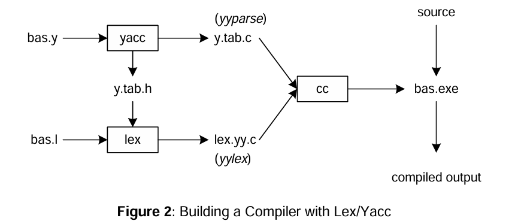

# Calculator
<pre>vim bas.y   
vim bas.l  
yacc –d bas.y                   # create y.tab.h, y.tab.c
lex bas.l                       # create lex.yy.c   
cc lex.yy.c y.tab.c –o bas.exe  # compile/link     
./bas.exe <pre>

  
